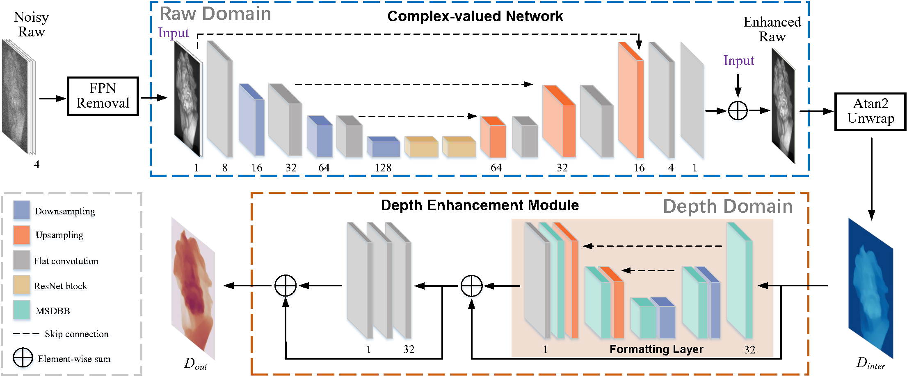

# Depth Restoration in Under-Display Time-of-Flight Imaging


## Introduction
⚡| [Paper](https://ieeexplore.ieee.org/abstract/document/9903562/) |

This repo is the PyTorch implementation of our paper in TPAMI-2022 to read ToF raw measurements and recover depth from them, developed by Xin Qiao, Chenyang Ge, Pengchao Deng, Hao Wei, Matteo Poggi and Stefano Mattoccia.

---



---


## Download
- synthetic:  https://pan.baidu.com/s/15oUIYyLr6Wmh09XmrAM3JA     Access code：we0d
- real: https://drive.google.com/drive/folders/1QDjPTZqPRskDJrKfkhrLju-ZmHRPAnXo?usp=drive_link

## Citation
If you use this data for your research, please cite our paper [Depth Restoration in Under-Display Time-of-Flight Imaging](https://ieeexplore.ieee.org/abstract/document/9903562/):

```
@article{qiao2022depth,
  author={Qiao, Xin and Ge, Chenyang and Deng, Pengchao and Wei, Hao and Poggi, Matteo and Mattoccia, Stefano},
  journal={IEEE Transactions on Pattern Analysis and Machine Intelligence}, 
  title={Depth Restoration in Under-Display Time-of-Flight Imaging}, 
  year={2023},
  volume={45},
  number={5},
  pages={5668-5683},
  doi={10.1109/TPAMI.2022.3209905}}
```
